# SomHR — Entity Relationship Diagram

Source of truth: `backend/prisma/schema.prisma` (validated). This diagram shows the core
relationships per domain; attribute lists are abbreviated for readability.

```mermaid
erDiagram
    %% ============ IDENTITY & ACCESS ============
    User ||--o| Employee : "is"
    User ||--o{ UserRole : has
    Role ||--o{ UserRole : grants
    Role ||--o{ RolePermission : maps
    Permission ||--o{ RolePermission : maps
    User ||--o{ RefreshToken : owns
    User ||--o{ Session : opens
    User ||--o{ Device : registers
    User ||--o| TwoFactorSecret : secures
    User ||--o{ PasswordResetToken : requests
    User ||--o{ AuditLog : acts
    User ||--o{ Notification : receives
    User ||--o{ Conversation : chats

    %% ============ ORGANIZATION ============
    Company ||--o{ Location : has
    Company ||--o{ Department : has
    Company ||--o{ Designation : has
    Company ||--o{ Band : has
    Company ||--o{ Employee : employs
    Department ||--o{ Department : "parent of"
    Department |o--o| Employee : "headed by"
    Band ||--o{ Designation : groups

    %% ============ EMPLOYEE MASTER ============
    Employee |o--o{ Employee : "manages (reporting line)"
    Department ||--o{ Employee : contains
    Designation ||--o{ Employee : titles
    Location ||--o{ Employee : "based at"
    Employee ||--o{ EmploymentEvent : timeline
    Employee ||--o{ Education : has
    Employee ||--o{ Experience : has
    Employee ||--o{ Certification : has
    Employee ||--o{ EmployeeSkill : has
    Skill ||--o{ EmployeeSkill : tagged
    Employee ||--o{ EmployeeDocument : stores
    Employee ||--o{ BankDetail : has
    Employee ||--o{ EmergencyContact : has

    %% ============ RECRUITMENT ============
    Department ||--o{ JobRequisition : requests
    Employee ||--o{ JobRequisition : raises
    JobRequisition ||--o{ RequisitionApproval : "approval chain"
    JobRequisition ||--o{ JobPosting : publishes
    JobPosting ||--o{ Application : receives
    Candidate ||--o{ Application : submits
    Candidate ||--o{ Resume : uploads
    Resume ||--o{ ResumeScore : "AI-scored"
    Application ||--o{ Interview : schedules
    Interview ||--o{ InterviewFeedback : collects
    Employee }o--o{ Interview : "panel of"
    Application ||--o{ Offer : results

    %% ============ ONBOARDING ============
    OnboardingTemplate ||--o{ OnboardingTaskDef : defines
    OnboardingTemplate ||--o{ OnboardingInstance : instantiates
    Employee ||--o{ OnboardingInstance : undergoes
    OnboardingInstance ||--o{ OnboardingTask : tracks
    OnboardingTaskDef ||--o{ OnboardingTask : "from def"
    OnboardingInstance ||--o{ DigitalForm : fills
    DigitalForm ||--o{ ESignature : "e-signed"

    %% ============ ATTENDANCE ============
    Shift ||--o{ ShiftAssignment : assigned
    Employee ||--o{ ShiftAssignment : works
    Employee ||--o{ AttendanceRecord : punches
    AttendanceRecord ||--o{ BreakLog : breaks
    AttendanceRecord ||--o{ AttendanceCorrection : corrects
    Employee ||--o{ OvertimeRecord : logs

    %% ============ LEAVE ============
    LeaveType ||--o{ LeavePolicy : governed
    LeaveType ||--o{ LeaveBalance : balances
    LeaveType ||--o{ LeaveRequest : typed
    Employee ||--o{ LeaveBalance : holds
    Employee ||--o{ LeaveRequest : requests
    Employee |o--o{ LeaveRequest : approves
    HolidayCalendar ||--o{ Holiday : lists

    %% ============ PAYROLL ============
    SalaryStructure ||--o{ SalaryStructureComponent : composed
    SalaryComponent ||--o{ SalaryStructureComponent : used
    Employee ||--o{ EmployeeSalary : earns
    SalaryStructure ||--o{ EmployeeSalary : applies
    EmployeeSalary ||--o{ EmployeeSalaryComponent : breakdown
    SalaryComponent ||--o{ EmployeeSalaryComponent : valued
    Employee ||--o{ SalaryRevision : revised
    PayrollRun ||--o{ Payslip : generates
    Employee ||--o{ Payslip : receives
    Payslip ||--o{ PayslipLine : itemized
    SalaryComponent ||--o{ PayslipLine : labels

    %% ============ PERFORMANCE ============
    AppraisalCycle ||--o{ Goal : scopes
    AppraisalCycle ||--o{ Objective : scopes
    Employee ||--o{ Goal : owns
    Goal ||--o{ Kpi : measures
    Employee ||--o{ Objective : owns
    Objective ||--o{ KeyResult : tracks
    AppraisalCycle ||--o{ SelfAssessment : collects
    AppraisalCycle ||--o{ ManagerReview : collects
    AppraisalCycle ||--o{ Feedback360 : collects
    Employee ||--o{ SelfAssessment : writes
    Employee ||--o{ ManagerReview : "subject of"
    Employee ||--o{ Feedback360 : "subject of"

    %% ============ ASSETS ============
    Asset ||--o{ AssetAssignment : assigned
    Employee ||--o{ AssetAssignment : holds
    Asset ||--o{ AssetMaintenance : maintained

    %% ============ HELPDESK ============
    TicketCategory ||--o{ Ticket : classifies
    SlaPolicy ||--o{ TicketCategory : governs
    Employee ||--o{ Ticket : raises
    Employee |o--o{ Ticket : "assigned to"
    Ticket ||--o{ TicketComment : threads
    Ticket ||--o{ TicketEscalation : escalates

    %% ============ EXPENSE ============
    Employee ||--o{ ExpenseReport : submits
    ExpenseReport ||--o{ ExpenseItem : itemizes
    ExpenseCategory ||--o{ ExpenseItem : classifies
    ExpenseReport ||--o| Reimbursement : "paid via"

    %% ============ EXIT ============
    Employee ||--o{ Resignation : files
    Resignation ||--o{ ClearanceItem : clears
    Resignation ||--o| ExitInterview : interviewed
    Resignation ||--o| FnfSettlement : settled

    %% ============ AI / RAG ============
    KnowledgeDocument ||--o{ KnowledgeChunk : "chunked + embedded"
    Conversation ||--o{ ChatMessage : contains
```

## Notes

- `KnowledgeChunk.embedding` is `vector(1536)` (pgvector) — created by
  `database/init/01-extensions.sql`, queried via raw SQL cosine distance.
- `TalentInsight` (AI scores: promotion readiness / attrition risk / high performer) is
  intentionally relation-free — it references `employeeId` logically and is rebuilt by jobs.
- All approval flows (`LeaveRequest`, `AttendanceCorrection`, `OvertimeRecord`,
  `SalaryRevision`, `RequisitionApproval`, `ExpenseReport`) share the `ApprovalStatus`
  state machine.
- Every privileged mutation writes an `AuditLog` row.
